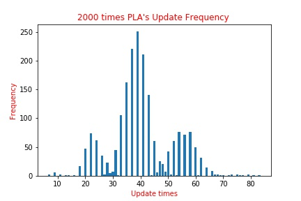

# Perceptron Learning Algorithm(PLA)
Use Perceptron Learning Algorithm(PLA) to training data until all data are coorect.

## Problem Description
In this assignment, I have to read the data in random sequence, and compute how many updating times it is when no mistake happen.

## Data Description
In 'perceptron_train.dat', each line have five values, first four values for feature(or attributes), and last one for label.

for instance:
0.97681 0.10723 0.64385 0.29556	1

## Use Language & Packages
- Python
- Numpy
- Pandas

## Output

## Detail
I havent write it.
