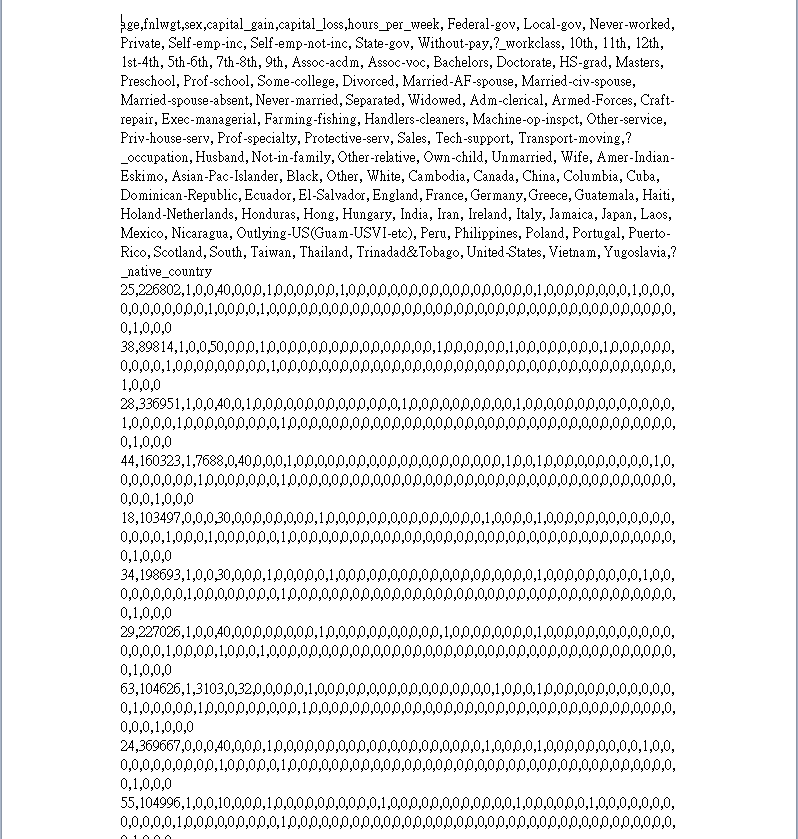
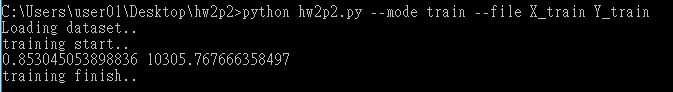

# Logistic_Regression(SGD version)
Assignment for use logistic regression to predict whether a person is poor or rich.

## Problem Description
Use 106 featutes(data had been preprocessed) to prdict a person is rich or poor(make over 50K yes or not).

## Data Description
- train_X: preprocessed-data, had finished one-hot encoding with discrete features, features with continuous remain the same.  


- train_Y: result for train_X, 1 means rich and 0 means poor.
- predictions.csv: use model to predict test_X data.
- others file(.model): training model. 

## Use Language & Packages
- Python 
- Numpy 

## Start Training
In command Line, use command
```console
python  hw2p2.py --mode train --file X_train Y_train
```

to start training 'X_train' and 'Y_train', after finish training, it will output accurancy(in this case, about 85%), crossentropy-value, and save some file(.model) , which save the logistic regression model.

## Start Testing
In command Line, use command
```console
python  hw2p2.py --mode train --file X_test
```

to start testing,the data size of testing-set can be different, it will auto-compute the data size.

## Output Predict Result
after finish testing, it will output a file which name is 'predictions.csv' that recorded the prediction.


## More Detail
[[Python]Logistic Regression (SGD version)](https://john850512.wordpress.com/2018/04/16/pythonlogistic-regression-sgd-version/#more-2338)
